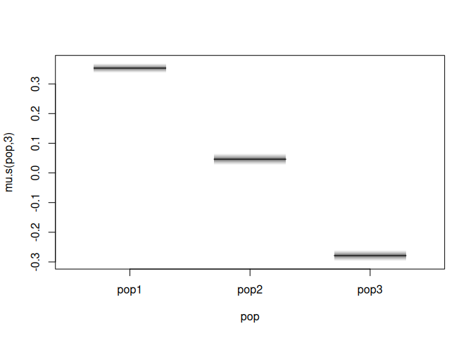
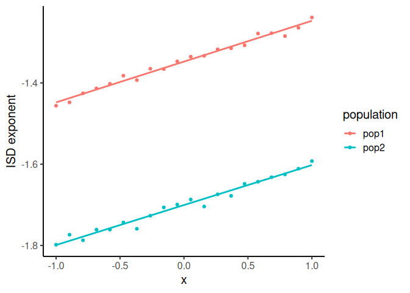
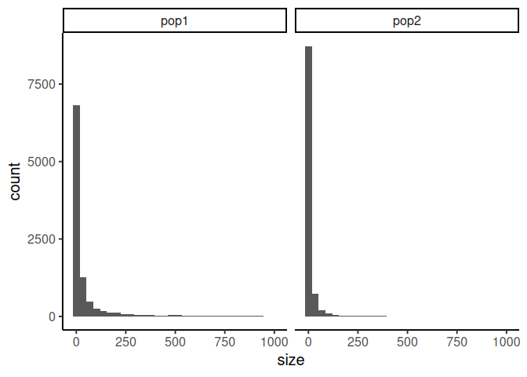
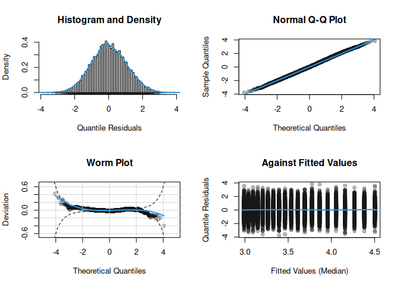
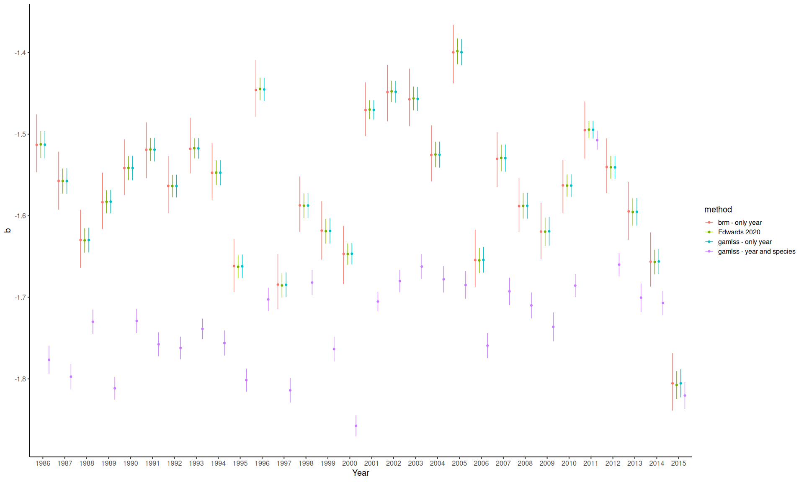
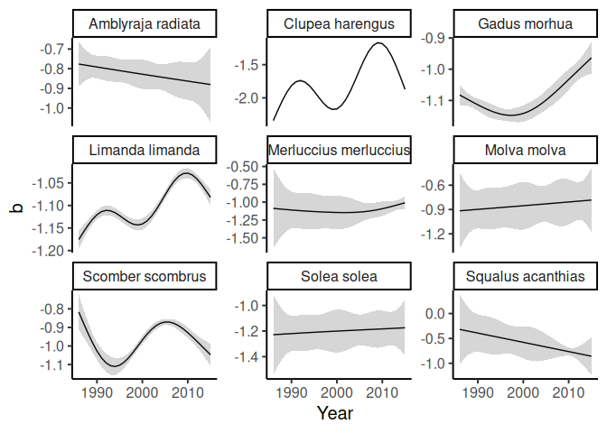

gamlss2.ISD: Modeling of size spectra under the GAMLSS framework
================
Alexis Lazaris

<!-- README.md is generated from README.Rmd. Please edit that file -->

# Overview

The goal of gamlss2.ISD is to estimate the exponent of the Individual
Size Distribution (ISD) for size spectra as described with a bounded
Power-Law distribution. The exponent can be estimated from raw body size
data within the GAMLSS framework as applied by the `gamlss2` package.
All the functionalities of the `gamlss2` package can be used.

# Installation

The `gamlss2.ISD` package requires installation of `gamlss2`:

``` r
install.packages("gamlss2",
  repos = c("https://gamlss-dev.R-universe.dev",
            "https://cloud.R-project.org"))
```

It can then be installed using `devtools`:

``` r
devtools::install_github("alexislaz/gamlss2.ISD")
```

For the examples presented here, the `sizeSpectra` package is also
needed:

``` r
remotes::install_github("andrew-edwards/sizeSpectra")
```

# Usage

The main function of the `gamlss2.ISD` package is `bPL` that can be used
inside a `gamlss2` call:

``` r
gamlss2(<sizes> ~ fac + te(x, z) + s(w, by = fac) + s(id, bs = "re"),
        data = <data>,
        family = bPL(<number_of_observations>, <minimum_size>, <maximum_size>))
```

which estimates the effects of covariates on the exponent (`b`) of the
ISD.

## Main variables

- `<sizes>` can be a vector of individual measurements of size or it can
  be a 2-column matrix of the bin ranges if data are collected in bins
  (`cbind(bin_from, bin_to)`). Both cases are handled separately
  internally with their respective likelihoods as developed by Edwards
  et al. (2017) and Edwards et al. (2020), respectively.
- `<number_of_observations>` can be a vector of
  `length == length(sizes)` (or `length == nrow(sizes)`) that denotes
  the number or, e.g., density of each observations and can be either an
  integer or a decimal. Alternatively, it can simply be a `length == 1`
  number when no such measurement exists (e.g. `bPL(counts = 1, ...)`).
- `<minimum_size>` and `<maximum_size>` denote the range of sizes that
  each observation is bounded in. It can either be a single number if
  all observations have the same size limits of a vector of
  `length == length(sizes)` (or `length == nrow(sizes)`) if different
  size limits for, e.g., different groups are needed. In that case, we
  need to prepare the data with an equivalent of
  `data$minima = ave(data$size, data$group, FUN = min)` and use it as
  `bPL(counts = .., lower = data$minima, upper = ...)`.
- `<data>` is the dataset to look for `<sizes>` as well as the rhs
  covariates.

# Examples

First load relevant packages:

``` r
library(dplyr)
library(ggplot2)
library(gamlss2)
library(sizeSpectra)

library(brms)
#devtools::install_github("jswesner/isdbayes") # a bayesian alternative to estimate within the ISD
library(isdbayes)

library(gamlss2.ISD)
```

## Estimate the ISD exponent from a single sample/population

We can simulate a dataset of body sizes from the bounded Power-Law
distribution using the `rPLB` from the `sizeSpectra` package:

``` r
d = data.frame(size = rPLB(1000, -2, 1, 1000))  # 1000 body sizes from ISD with b = -2 bounded in [1, 1000]
```

And then estimate the exponent using GAMLSS:

``` r
m = gamlss2(size ~ 1, 
            data = d, 
            family = bPL(1, 1, 1000)) # all counts = 1, range [1, 1000] as simulated
```

``` r
summary(m)
#> Call:
#> gamlss2(formula = size ~ 1, data = d, family = bPL(1, 1, 1000))
#> ---
#> Family: bPL 
#> Link function: b = identity
#> *--------
#> Parameter: b 
#> ---
#> Coefficients:
#>             Estimate Std. Error t value Pr(>|t|)    
#> (Intercept) -1.98071    0.03186  -62.17   <2e-16 ***
#> ---
#> Signif. codes:  0 '***' 0.001 '**' 0.01 '*' 0.05 '.' 0.1 ' ' 1
#> *--------
#> n = 1000 df =  1 res.df =  999
#> Deviance = 4044.7265 Null Dev. Red. = 0%
#> AIC = 4046.7265 elapsed =  0.01sec
```

## Estimate the ISD exponent from multiple populations

As a more complicated example, we can simulate body sizes for different
populations with different characteristics:

``` r
# population-specific size ranges
pop1_size_range = c(10, 800)
pop2_size_range = c(20, 1000)
pop3_size_range = c(1, 300)

# population-specific 'b'
pop1_b = -1.2
pop2_b = -1.5
pop3_b = -1.8

dat = rbind(
  data.frame(pop = "pop1", 
             size = round(rPLB(1e4, pop1_b, pop1_size_range[1], pop1_size_range[2])),
             mn = pop1_size_range[1], mx = pop1_size_range[2]),
  data.frame(pop = "pop2", 
             size = round(rPLB(1e4, pop2_b, pop2_size_range[1], pop2_size_range[2])),
             mn = pop2_size_range[1], mx = pop2_size_range[2]),
  data.frame(pop = "pop3", 
             size = round(rPLB(1e4, pop3_b, pop3_size_range[1], pop3_size_range[2])),
             mn = pop3_size_range[1], mx = pop3_size_range[2])
)
dat$pop = factor(dat$pop) # convert to factor for models
```

And then estimate the exponents (b) for each population:

``` r
m = gamlss2(size ~ pop, 
            data = dat, 
            family = bPL(1, dat$mn, dat$mx))
```

Timing:

``` r
summary(m)$elapsed # seconds of model fitting
#> [1] 0.839
```

See the estimates:

``` r
predict(m, newdata = data.frame(pop = c("pop1", "pop2", "pop3")), se.fit = TRUE)
#>            fit          se
#> [1,] -1.203280 0.007649465
#> [2,] -1.508659 0.009011311
#> [3,] -1.838063 0.009562694
```

Alternatively, for faster fitting, we can aggregate equal sizes with
their respective abundance:

``` r
dat_counts = dat |> 
  group_by(pop, size, mn, mx) |>
  summarize(n = n()) |>
  ungroup()

m = gamlss2(size ~ pop, 
            data = dat_counts, 
            family = bPL(dat_counts$n, dat_counts$mn, dat_counts$mx))
```

Reduced model fitting time:

``` r
summary(m)$elapsed
#> [1] 0.049
```

Identical estimates:

``` r
predict(m, newdata = data.frame(pop = c("pop1", "pop2", "pop3")), se.fit = TRUE)
#>            fit          se
#> [1,] -1.203280 0.007649465
#> [2,] -1.508659 0.009011311
#> [3,] -1.838063 0.009562694
```

We can, also, utilize the random effects structure that `gamlss2`
offers:

``` r
m = gamlss2(size ~ s(pop, bs = "re"), 
            data = dat_counts, 
            family = bPL(dat_counts$n, dat_counts$mn, dat_counts$mx))
```

Where we obtain similar estimates:

``` r
predict(m, newdata = data.frame(pop = factor(levels(m$model$pop), levels(m$model$pop))), se.fit = TRUE)
#>            fit          se
#> [1,] -1.203546 0.007110215
#> [2,] -1.508678 0.009321382
#> [3,] -1.837689 0.009254466
```

And we can, also, visualize using the built-in `plot.gamlss2`:

``` r
plot(m)
```

<!-- -->

## Estimate the effect of a predictor on the ISD exponent

Finally, as a more complex example, we can simulate a predictor that
affects the exponent of the ISD while using random intercepts:

``` r
# setup global intercept and slope and a hardcoded 'random' intercept
set.seed(1)

intercept = -1.5   # global
slope = 0.1        # global

x.lvls = seq(-1, 1, length.out = 20)  # 'x' covariate
g.lvls = factor(c("pop1", "pop2"))    # different samples

# setup grid
x = rep(x.lvls, each = length(g.lvls))
g = rep(g.lvls, length(x.lvls))

b0 = c(0.15, -0.2) # 'random' intercept deviations from global
# the random intercepts are:
intercept + b0
#> [1] -1.35 -1.70

X = model.matrix( ~ x)
Z0 = model.matrix( ~ -1 + g)

y = (X %*% c(intercept, slope)) + (Z0 %*% b0) + rnorm(length(x), 0, 0.01)

# collect in a data.frame
dat = data.frame(y = y, x = x, g = g)
```

Visualize the dependence of the exponent on ‘x’:

``` r
ggplot(dat) + 
  theme_classic(base_size = 15) + 
  geom_point(aes(x = x, y = y, colour = g)) + 
  geom_smooth(aes(x = x, y = y, colour = g), method = "lm", se = FALSE) +
  labs(x = "x", y = "ISD exponent", colour = "population")
```

<!-- -->

And now simulate actual individual sizes from the grid of exponents:

``` r
dat_sizes = do.call(rbind,
                    Map(function(beta, x, g) 
                      data.frame(g = g, 
                                 x = x, 
                                 size = rPLB(500, beta, 1, 1000)), 
                      dat$y, dat$x, dat$g))
```

And visualize our simulated sizes. We note that “pop2” has a steeper
size spectra “slope” (b) and, hence, more smaller individuals:

``` r
ggplot(dat_sizes) + 
  theme_classic(base_size = 15) + 
  facet_wrap(vars(g)) + 
  geom_histogram(aes(x = size))
```

<!-- -->

Fit the mixed model:

``` r
# run model
m = gamlss2(size ~ x + re(fixed = ~x, random = ~1|g), data = dat_sizes, family = bPL(1, 1, 1000))
```

Inspect the model fit:

``` r
plot(m)  # built-in diagnostics
```

<!-- -->

And retrieve the estimated intercepts and slopes:

``` r
# the estimated intercepts are:
coef(specials(m)$model)[, 1] + coef(m)[1]
#> [1] -1.340269 -1.706577
# the actual intercepts are:
intercept + b0
#> [1] -1.35 -1.70

# the estimated slopes are:
coef(specials(m)$model)[, 2] + coef(m)[2]
#> [1] 0.09679744 0.09679744
# the actual slope is:
slope
#> [1] 0.1
```

## Estimate the ISD exponent from real-world data

We’ll use the built-in `IBTS_data` dataset of the `sizeSpectra` package
with records of individual length measurements of fish species as
described in Edwards et al. (2020). First, we can replicate the results
from Figure 8 from that publication, using the GAMLSS framework. We
also, examine a model that accounts for species-specific differences of
the exponent of the Power-Law distribution. We, also, fit a model using
`isdbayes`, which, equivalently fits a bounded Power-Law (truncated
Pareto) under a bayesian framework (Wesner et al. (2024)).

First, format the dataset:

``` r
dat = IBTS_data |>
  group_by(Year) |>
  mutate(mn = min(bodyMass), mx = max(bodyMass)) |> # in Edwards et al. 2020, min and max sizes are separated by year analysis
  mutate(Year = factor(Year), SpecCode = factor(SpecCode)) |>
  ungroup()
```

Fit the GAMLSS models. We use the `binning = TRUE` argument of
`gamlss2_control` to fit model more efficiently. First, a model only
with a random effect for Year:

``` r
m_gam_year = gamlss2(bodyMass ~ s(Year, bs = "re"), 
                data = dat, 
                family = bPL(dat$Number, dat$mn, dat$mx), 
                control = gamlss2_control(binning = TRUE)) 
```

And we, also, fit a model accounting for a simple inter-species effect
on ‘b’:

``` r
m_gam_year_species = gamlss2(bodyMass ~ s(Year, bs = "re") +  s(SpecCode, bs = "re"), 
                             data = dat, 
                             family = bPL(dat$Number, dat$mn, dat$mx), 
                             control = gamlss2_control(binning = TRUE))
```

And finally, collect predicted effects from both models (in a similar
notation to `sizeSpectra`):

``` r
eff_gam_year = m_gam_year$results$effects[[1]] |>
  mutate(b = fit + coef(m_gam_year),
         confMin = lower + coef(m_gam_year),
         confMax = upper + coef(m_gam_year)) 
eff_gam_year_species = m_gam_year_species$results$effects[[1]] |>
  mutate(b = fit + coef(m_gam_year_species),
         confMin = lower + coef(m_gam_year_species),
         confMax = upper + coef(m_gam_year_species))
```

Also, fit the `brm` model, using the truncated Pareto parameterized with
Stan in the `isdbayes` package:

``` r
m_bayes_year = brm(bodyMass | vreal(Number, mn, mx) ~ (1|Year), 
                   data = dat,
                   stanvars = stanvars,
                   family = paretocounts(),
                   chains = 1, iter = 1000)  # need to increase `chains` and `iter` for better estimates
```

And, once again, collect the effects of the `brm` fit (in a similar
notation to `sizeSpectra`):

``` r
eff_bayes_year = ranef(m_bayes_year)[[1]][, , "Intercept"] |>
  as.data.frame() |>
  mutate(b = Estimate + fixef(m_bayes_year)[, "Estimate"],
         confMin = Q2.5 + fixef(m_bayes_year)[, "Estimate"],
         confMax = Q97.5 + fixef(m_bayes_year)[, "Estimate"]) |>
  add_rownames("Year")
```

Finally, replicate the results of Figure 8 from Edwards et al. (2020).
(NOTE: `sizeSpectra::eightMethods.count` creates figures by default in
the home directory! take care to delete them afterwards!)

``` r
# replicate the MLE of 'b' from Edwards et al. 2020 using `eightMethods.count` 
eff_mle = do.call(rbind, 
                lapply(split(IBTS_data, IBTS_data$Year), 
                       function(data) subset(eightMethods.count(data, data$Year[1]), Method == "MLE")))
```

And plot all the estimates. After plotting we can see the almost
identical estimates between GAMLSS, the bayesian fit, and the MLE from
Edwards et al. 2020. Accounting for the different species, though,
changes the estimated exponents.

``` r
# collect both estimations in a single dataset and plot predictions of 'b'
rbind(cbind(method = "gamlss - only year", eff_gam_year[, c("Year", "b", "confMin", "confMax")]), 
      cbind(method = "gamlss - year and species", eff_gam_year_species[, c("Year", "b", "confMin", "confMax")]),
      cbind(method = "brm - only year", eff_bayes_year[, c("Year", "b", "confMin", "confMax")]),
      cbind(method = "Edwards 2020", eff_mle[, c("Year", "b", "confMin", "confMax")])) |>
  ggplot() + 
  theme_classic(base_size = 15) + 
  geom_point(aes(x = Year, y = b, colour = method), position = position_dodge(width = 0.75)) + 
  geom_errorbar(aes(x = Year, ymin = confMin, ymax = confMax, colour = method), width = 0.0, position = position_dodge(width = 0.75))
```

<!-- -->

Besides this simple random year intercept model, we can, also, fit a
more complex model using the `IBTS_data` dataset. First clean-up the
data a bit:

``` r
species_selection = c(105865, 126417, 126436, 127139, 126461, 126484, 127023, 127160, 105923) # select a few species
dat = IBTS_data |>
  group_by(SpecCode) |> 
  mutate(mn = min(bodyMass), mx = max(bodyMass)) |> # add minimum and maximum size by species (and not by Year)
  ungroup() |>
  filter(SpecCode %in% species_selection) |> 
  mutate(species = factor(SpecCode))
```

Now fit a more sophisticated GAM:

``` r
m = gamlss2(bodyMass ~ species + s(Year, by = species, k = 5), 
            data = dat, 
            family = bPL(dat$Number, dat$mn, dat$mx),
            control = gamlss2_control(binning = TRUE))
```

And visualize the effects:

``` r
prediction_grid = expand.grid(Year = sort(unique(m$model$Year)),
                              species = factor(levels(m$model$species), levels(m$model$species)))
predictions = cbind(prediction_grid, 
                    predict(m, 
                            newdata = prediction_grid, se.fit = TRUE,
                            terms = c("(Intercept)", "Year", "species"),
                            nogrep = FALSE))
predictions$species = specCodeNames$species[match(as.character(predictions$species), specCodeNames$speccode)] # use species scientific names

ggplot(predictions) + 
  theme_classic(base_size = 15) +
  facet_wrap(vars(species), scales = "free_y") + 
  geom_line(aes(x = Year, y = fit)) + 
  geom_ribbon(aes(x = Year, ymin = fit-se, ymax = fit+se), alpha = 0.2) + 
  labs(y = "b")
```

<!-- -->

## Using binned data

As a very simple example, we demonstrate the differences, in estimating
the exponent of ISD from binned data, between using the middle value of
the bin or the full range of the bin. We’ll use the
`sizeSpectra::binData` utility function for this:

``` r
d = binData(rPLB(1e5, -1.5, 1, 100), binWidth = "2k")$binVals
```

And then estimate the exponent either the middle value (which is
slightly off):

``` r
summary(
  gamlss2(binMid ~ 1, 
          data = d, 
          family = bPL(d$binCount, min(d$binMid), max(d$binMid)))
)
#> GAMLSS-RS iteration  1: Global Deviance = 537254.9778 eps = 0.003052     
#> GAMLSS-RS iteration  2: Global Deviance = 537254.9778 eps = 0.000000
#> Call:
#> gamlss2(formula = binMid ~ 1, data = d, family = bPL(d$binCount, 
#>     min(d$binMid), max(d$binMid)))
#> ---
#> Family: bPL 
#> Link function: b = identity
#> *--------
#> Parameter: b 
#> ---
#> Coefficients:
#>             Estimate Std. Error t value Pr(>|t|)    
#> (Intercept) -1.72492    0.00322  -535.8 2.85e-15 ***
#> ---
#> Signif. codes:  0 '***' 0.001 '**' 0.01 '*' 0.05 '.' 0.1 ' ' 1
#> *--------
#> n = 7 df =  1 res.df =  6
#> Deviance = 537254.9778 Null Dev. Red. = 0%
#> AIC = 537256.9778 elapsed =  0.00sec
```

or the bin range (which estimates ‘b’ more closely):

``` r
summary(
  gamlss2(cbind(binMin, binMax) ~ 1, 
          data = d, 
          family = bPL(d$binCount, min(d$binMin), max(d$binMax)))
)
#> GAMLSS-RS iteration  1: Global Deviance = 343474.0638 eps = 0.004798     
#> GAMLSS-RS iteration  2: Global Deviance = 343474.0638 eps = 0.000000
#> Call:
#> gamlss2(formula = cbind(binMin, binMax) ~ 1, data = d, family = bPL(d$binCount, 
#>     min(d$binMin), max(d$binMax)))
#> ---
#> Family: bPL 
#> Link function: b = identity
#> *--------
#> Parameter: b 
#> ---
#> Coefficients:
#>              Estimate Std. Error t value Pr(>|t|)    
#> (Intercept) -1.526475   0.002657  -574.5 1.88e-15 ***
#> ---
#> Signif. codes:  0 '***' 0.001 '**' 0.01 '*' 0.05 '.' 0.1 ' ' 1
#> *--------
#> n = 7 df =  1 res.df =  6
#> Deviance = 343474.0638 Null Dev. Red. = 0%
#> AIC = 343476.0638 elapsed =  0.00sec
```

## References

<div id="refs" class="references csl-bib-body hanging-indent"
entry-spacing="0">

<div id="ref-edwards2020" class="csl-entry">

Edwards, Andrew M., James P. W. Robinson, Julia L. Blanchard, Julia K.
Baum, and Michael J. Plank. 2020. “Accounting for the Bin Structure of
Data Removes Bias When Fitting Size Spectra.” *Marine Ecology Progress
Series* 636: pp. 19–33. <https://www.jstor.org/stable/26920653>.

</div>

<div id="ref-edwards2017" class="csl-entry">

Edwards, Andrew M., James P. W. Robinson, Michael J. Plank, Julia K.
Baum, and Julia L. Blanchard. 2017. “Testing and Recommending Methods
for Fitting Size Spectra to Data.” *Methods in Ecology and Evolution* 8
(1): 57–67. https://doi.org/<https://doi.org/10.1111/2041-210X.12641>.

</div>

<div id="ref-gamlss" class="csl-entry">

Rigby, R. A., and D. M. Stasinopoulos. 2005. “Generalized Additive
Models for Location, Scale and Shape.” *Journal of the Royal Statistical
Society Series C: Applied Statistics* 54 (3): 507–54.
<https://doi.org/10.1111/j.1467-9876.2005.00510.x>.

</div>

<div id="ref-wesner2024" class="csl-entry">

Wesner, Jeff S., Justin P. F. Pomeranz, James R. Junker, and Vojsava
Gjoni. 2024. “Bayesian Hierarchical Modelling of Size Spectra.” *Methods
in Ecology and Evolution* 15 (5): 856–67.
https://doi.org/<https://doi.org/10.1111/2041-210X.14312>.

</div>

</div>
